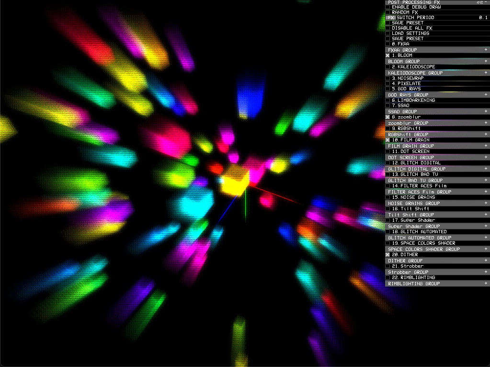

# ofxPostProcessing
I've added additional filter effects and manager gui to easily to adjust effect parameters.

## Features
- [x] GUI added
- [x] GUI: Random FX on button click
- [x] GUI: Randomize Effects continously in a time interval
- [x] GUI: Random FX SWITCH PERIOD: Set the time interval between fx switch
- [x] GUI: Load a preset setup (json)
- [x] GUI: Save the current preset setup (json)
- [x] GUI: Edit FX shader parameters on the fly
- [ ] Better GUI approach without using an external lib.
- [ ] Add support for ofGLProgrammableRenderer with version 150 shaders
- [ ] More FX



## ofxPostProcessingManager Usage
See the example project in **ofApp.h**;

```#include "ofxPostProcessingManager.h"```

Declare object as follows;

```ofxPostProcessingManager manager;```


In setup();

```manager.setup(ofGetWidth(), ofGetHeight());```


In update();

```manager.updateValues();```


In draw();

```
 // begin scene to post process if you have cam.
 // if not leave empty
    manager.begin(cam);
    
    // draw your content

    // end scene and draw
    manager.end();
```

------------------


This openFrameworks addon gives you an easy way of putting together a chain of GLSL post-processing effects.

www.neilmendoza.com/ofxpostprocessing

NB This addon uses the branch setup as OF itself, the stable branch corresponds to the most recent release (i.e. the version that is downloadable from the OF site) and the master branch is the develop branch. If you have downloaded from the website, the you will want to use the stable branch...

https://github.com/neilmendoza/ofxPostProcessing/tree/stable

## Features

At the moment, it comes with the following effects (some ported from other sources and some original) that I'll gradually add to over time:

* Bloom
* Convolution (Blur)
* Depth of field (with bokeh)
* Depth of field alternative (more features but heavier)
* Frei-Chen Edge Detector
* FXAA anti-aliasing
* Kaleidoscope
* Noise warp
* Pixelate
* SSAO
* Toon
* Godrays
* Tilt shift
* Fake subsurface scattering
* Many others, please see src directory

**Plus 12 more effects are added to ofxPostProcessing addon**
* FilmGrainLinesPass
* DotScreenPass
* DigitalGlitchPass
* FirePass
* BadTVPass
* ACESFilmicToneMappingPass
* NoisePass
* TiltShiftPass
* SuperPass
* GlitchAutomatedPass
* SpaceColorMovePass
* DitherPass

## Usage

In your OF app declare an instance of **ofxPostProcessing**...

```cpp
ofxPostProcessing post;
```

In your **setup()** function initialise the post-processing class and then add some effects...

```cpp
post.init(ofGetWidth(), ofGetHeight());
post.createPass<FxaaPass>();
post.createPass<BloomPass>();
```

Call **post.begin()** and **post.end()** around the the scene that you want to render...

```cpp
post.begin();
<RENDERING CODE>
post.end();
```

If you are using an **ofCamera** pass this to **post.begin()** and it takes care of the rest for you...

```cpp
post.begin(cam);
<RENDERING CODE>
post.end();
```
